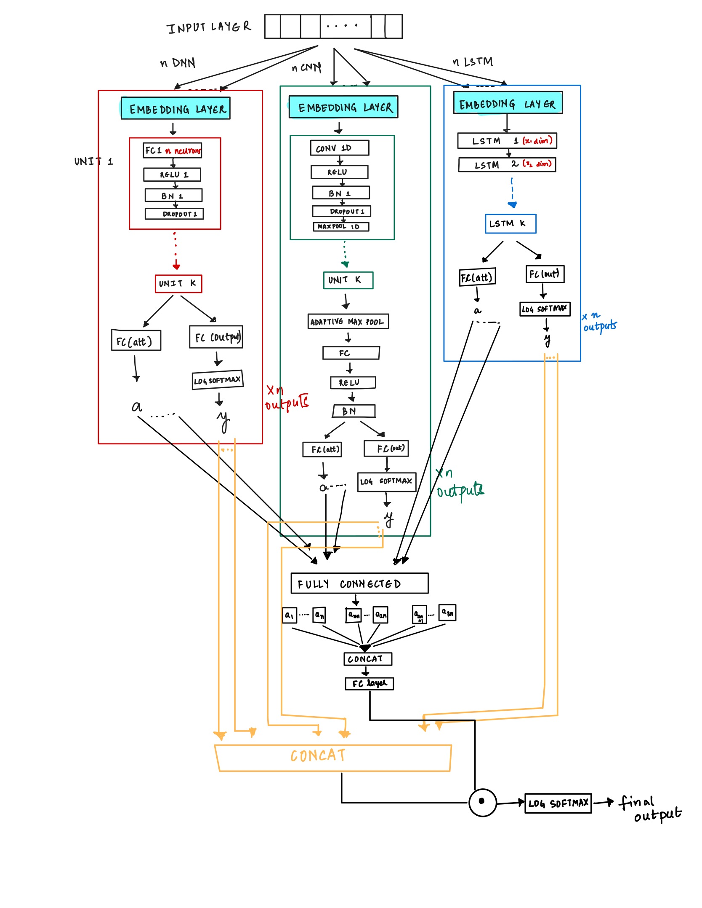
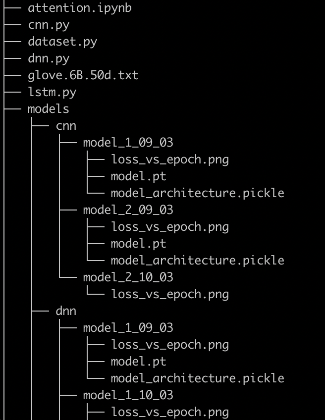

## ARDL: Attention based Random Deep Learning for Text Classification

PyTorch implementation of the ARDL model which is meant to be a flexible framework for building, training and testing ensembles of different models for text classification. 

### The original graphrec architecture is as follows:

For running the code you will need to first download the glove embeddings from https://nlp.stanford.edu/projects/glove/ into the root folder.

The dataset.py file contains all the utils to preprocess the dataset that is currently twenty newsgroup

Main structure of CNN, DNN and LSTM lies in cnn.py, dnn.py and lstm.py respectively.

To train CNN, DNN and LSTM use test_CNN.ipynb, test_DNN.ipynb and test_LSTM.ipynb notebooks as reference.

The main architecture of final attention model lies in attention.ipynb alongwith it's training and testing.

### The folder structure for models and Glove embeddings is as follows

